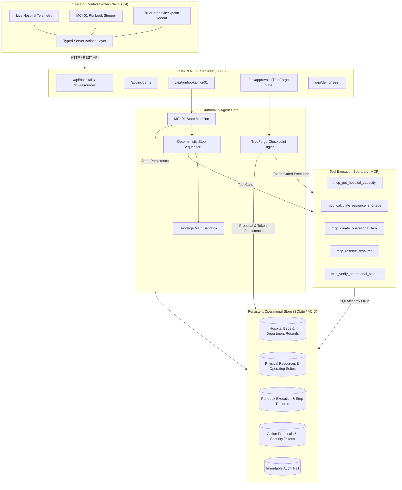

# AIMBULENCE 🚑

> **AI Emergency Hospital Operations Runbook Executor**  
> Built for the **Agents That Act** Hackathon (TrueFoundry × Polaris / HackCulture)  
> **Theme:** RUNBOOK EXECUTOR  
> **Tagline:** *"Act Fast. Coordinate Smart. Keep Humans in Control."*  
> **Repository:** [https://github.com/AkashMushigeri/Aimbulence](https://github.com/AkashMushigeri/Aimbulence)  
> **Current Branch:** `member-1`  
> **Test Status:** 🟢 48/48 Backend Pytest Passed | 🟢 142/142 Frontend Vitest Passed  

---

## Executive Overview

**AIMBULENCE** is an autonomous, safety-gated AI operational runbook executor that coordinates hospital surge capacity, staff mobilization, and critical supplies during Mass Casualty Incidents (MCIs). 

During catastrophic events (such as a 42-casualty multi-vehicle highway collision), hospital emergency operations centers are overwhelmed by dozens of simultaneous logistical phone calls, resource checks, and manual checklists. Static paper runbooks create deadly coordination bottlenecks.

AIMBULENCE transforms static disaster response procedures into an **interactive, observable, and verifiable execution pipeline**. The agent reads real hospital operational state, autonomously performs routine operational preparations, and **strictly halts at consequential decisions** (such as commandeering active surgical suites or declaring disaster status) until an authorized human operator grants cryptographic approval.

### Core Architectural Axiom
> **"Autonomous in execution, but not autonomous in authority."**

---

## Key Features

- **⚡ Autonomous Fast-Track Coordination:** Automatically queries operational telemetry, calculates acute resource deficits, dispatches emergency triage checklists, and stages uncrossmatched blood reserves.
- **🛡️ TrueForge Human-in-the-Loop Checkpoint:** High-impact, irreversible operational actions (RED tier) trigger an automated pause. The system generates an immutable proposal and requires human sign-off before mutating the database.
- **🔐 Cryptographically Bound Single-Use Tokens:** Approvals are secured with 32-byte cryptographically bound tokens locked to the specific action ID and target resource. Replay attacks, cross-resource reuse, and forged executions are rejected.
- **🛑 Zero-Mutation Rejection Guarantee:** If an operator rejects a proposed consequential action, the database remains 100% unmutated. Zero preemptive or speculative writes occur.
- **💾 ACID-Compliant SQLite Persistence:** Complete runbook state, step logs, approval checkpoints, and operational resources survive server reboots and process restarts.
- **📊 Real-Time Operator Control Center:** Next.js 14 dashboard with live telemetry meters, visual MCI-01 step progression, and interactive TrueForge approval modals.
- **📜 Append-Only Audit Trail:** Microsecond-precision audit logging of every query, calculation, task dispatch, approval, and state verification.

---

## Why AIMBULENCE Is an Agent (Not a Chatbot)

| Conventional Chatbot | AIMBULENCE Runbook Executor |
| :--- | :--- |
| Generates unstructured text summaries. | Interacts directly with external operational databases via MCP and typed tool interfaces. |
| Has no concept of persistent operational state. | Maintains an active, ACID-persisted state model of hospital capacity and resources. |
| Cannot perform real actions in external systems. | Issues concrete state mutations (stages beds, reserves supplies, reassigns suites). |
| Assumes actions succeed once hallucinated. | Independently queries connected systems post-execution to **verify** state changes. |
| Operates without strict safety boundaries. | Enforces a hard-stop TrueForge security checkpoint for consequential actions. |
| Stateless conversation. | Stateful, resumable state machine that survives process restarts mid-runbook. |

---

## System Architecture



Detailed architectural specifications and component boundaries are documented in [docs/architecture.md](docs/architecture.md).

---

## Safety and Human Governance Model

AIMBULENCE implements a three-tier action classification framework:

| Tier | Category | Autonomy | Operational Blast Radius | Examples |
| :---: | :---: | :---: | :---: | :--- |
| 🟢 | **GREEN** | **Fully Autonomous** | Zero / Internal Only | Read bed capacity, run shortage calculations, stage triage checklists, record audit logs. |
| 🟡 | **YELLOW** | **Autonomous with Notification** | Low / Readily Reversible | Stage auxiliary cots in ambulance bay, reserve uncrossmatched blood units, pre-alert on-call nurses. |
| 🔴 | **RED** | **Human Approval Required** | High / Disruptive / Irreversible | Commandeer active Operating Room (`OR-3`), suspend elective procedures, declare Code Orange. |

### The TrueForge Checkpoint Flow
1. **DETECT:** Agent identifies acute surgical shortage requiring an additional operating suite.
2. **PROPOSE:** Agent formulates proposal to commandeer `OR-3`, generates a 32-byte token digest, and pauses execution.
3. **ZERO MUTATION:** Database remains untouched; `OR-3` remains allocated to its elective procedure.
4. **HUMAN GATE:** The dashboard presents the TrueForge modal with full blast-radius analysis to the clinical operator.
5. **DECISION:**
   - **Authorize:** The single-use token is transmitted to `/api/approvals/{id}/respond`. Token is consumed, `OR-3` is commandeered in SQLite, post-action verification confirms state, and runbook finishes Steps 11–15.
   - **Reject:** The action is permanently denied, zero state changes occur, and runbook enters `HALTED_REJECTED`.

Full safety protocols and cryptographic proofs are detailed in [docs/safety_model.md](docs/safety_model.md).

---

## Mass Casualty Response Runbook (`MCI-01`)

The implemented MCI-01 emergency protocol executes 15 ordered operational steps:

```
 1. INGEST_INCIDENT           — Receive Mass Casualty Alert (42 casualties inbound)
 2. VALIDATE_INCIDENT         — Verify telemetry integrity and incident scale
 3. ASSESS_SEVERITY           — Project triage breakdown (Immediate, Delayed, Minor)
 4. QUERY_HOSPITAL_CAPACITY   — Query real-time bed occupancy (ED: 12 free, ICU: 4 free)
 5. QUERY_STAFF_AVAILABILITY  — Inspect trauma specialist and nurse shift rosters
 6. INSPECT_CONSUMABLES       — Audit O-negative blood reserves and airway carts
 7. CALCULATE_DEFICITS        — Deterministic sandbox math (30 bed deficit, 2 OR deficit)
 8. SYNTHESIZE_PLAN           — Generate phased mobilization and surge plan
 9. EXECUTE_GREEN_ACTIONS     — Dispatch trauma alerts, stage bay, reserve blood
─── ⏸️ TRUEFORGE CHECKPOINT GATE ────────────────────────────────────────────────
10. COMMANDEER_OR3 [RED]      — PAUSE: Await Human Approval to commandeer OR-3
─── ▶️ POST-APPROVAL RESUMPTION ─────────────────────────────────────────────────
11. NOTIFY_SURGICAL_TEAMS     — Mobilize standby trauma surgery teams to OR-3
12. PREPARE_RECOVERY_BAY      — Clear post-anesthesia care unit beds
13. MOBILIZE_TRANSPORT        — Dispatch internal gurneys and patient transport
14. VERIFY_SYSTEM_READINESS   — Confirm all resource mutations materialized on disk
15. FINALIZE_MCI_READINESS    — Generate final hospital readiness score & audit seal
```

---

## Technology Stack

- **Backend:** Python 3.11+, FastAPI, SQLAlchemy, Pydantic v2
- **Agent Harness & Safety:** TrueForge Human-in-the-Loop Checkpoints, MCP Tool Interface
- **Database:** Persistent ACID SQLite (WAL mode)
- **Frontend Dashboard:** Next.js 14 (App Router), TypeScript, Tailwind CSS, Lucide React
- **Testing & Quality Assurance:** Pytest, pytest-asyncio, Vitest, Testing Library

---

## Project Structure

```
Aimbulence/
├── backend/
│   ├── app/
│   │   ├── agent/               # TrueForge runner & approval cycle harness
│   │   ├── api/routes/          # REST endpoints (hospital, runbooks, approvals, demo)
│   │   ├── approval/            # TrueForge Checkpoint Manager & token security
│   │   ├── mcp/                 # Model Context Protocol server & tool adapters
│   │   ├── models/              # SQLAlchemy & Pydantic domain models
│   │   ├── runbooks/            # MCI-01 state machine & step execution engine
│   │   ├── services/            # SQLite database session & demo reset services
│   │   └── tools/               # Operational tools (capacity, shortage, tasks, verify)
│   └── tests/                   # 48 Automated backend integration tests
│
├── frontend/
│   ├── src/
│   │   ├── app/                 # Next.js 14 App Router & typed server actions
│   │   ├── components/          # Dashboard panels, TrueForge modal, telemetry widgets
│   │   ├── lib/                 # Tested mappers, domain types, API clients
│   │   └── services/            # Operations service bridge
│   └── tests/                   # 142 Automated Vitest frontend tests
│
└── docs/                        # Complete technical specifications & demo guides
    ├── architecture.md          # Full system architecture & Mermaid diagrams
    ├── safety_model.md          # Action tiers, token security & zero-mutation proof
    ├── demo_script.md           # 3-5 minute live presentation script & cues
    ├── api_contract.md          # REST API schemas & payload contracts
    └── phase7_e2e_validation.md # E2E test matrix & security verification
```

---

## Setup & Local Development

### 1. Prerequisites
- **Python:** 3.11+ (virtual environment recommended)
- **Node.js:** 20+ LTS or 22+ LTS
- **npm:** 9+

### 2. Backend Setup
```bash
# Clone the repository
git clone https://github.com/AkashMushigeri/Aimbulence.git
cd Aimbulence

# Setup Python virtual environment
python -m venv .venv
.\.venv\Scripts\activate   # On Linux/macOS: source .venv/bin/activate

# Install dependencies
pip install -r backend/requirements.txt

# Start backend server (runs on http://localhost:8000)
uvicorn backend.app.main:app --host 0.0.0.0 --port 8000 --reload
```

### 3. Frontend Setup
```bash
# In a separate terminal, navigate to frontend
cd frontend

# Install dependencies
npm install

# Start Next.js development server (runs on http://localhost:3000)
npm run dev
```

### 4. Demo Reset & State Initialization
To initialize or restore the database to a clean, seeded baseline at any time:
```bash
curl -X POST http://localhost:8000/api/demo/reset
```

---

## Verification & Automated Tests

AIMBULENCE is backed by a comprehensive automated test suite guaranteeing end-to-end reliability, security boundaries, and zero mock pollution:

### Run Backend Tests (48/48 Passing)
```powershell
.\.venv\Scripts\pytest.exe backend/tests/ -v
```
*Covers: API contracts, MCP server tool discovery, TrueForge approval tokens, anti-replay exploits, process restart recovery, and full MCI-01 end-to-end runs.*

### Run Frontend Tests (142/142 Passing)
```powershell
cd frontend
npm test -- --run
```
*Covers: Server action boundaries, console panels, TrueForge approval modal state, telemetry gauges, domain mappers, and zero-secret leaks.*

---

## 3–5 Minute Live Demo Sequence

Follow the complete step-by-step presentation script in [docs/demo_script.md](docs/demo_script.md):

1. **Open Dashboard:** Navigate to `http://localhost:3000`. Point to live hospital telemetry (12 ED beds, 4 ICU beds, OR-3 in elective use).
2. **Trigger Incident:** Click **"Trigger MCI-01 Runbook"** (Category 1 Mass Casualty — 42 inbound casualties).
3. **Autonomous Execution:** Watch Steps 1–9 execute in seconds: triage area established, blood bank staged, shortages calculated.
4. **The Intercept:** Step 10 requests commandeering active surgical suite `OR-3`. System automatically halts (`PAUSED_FOR_APPROVAL`). TrueForge modal appears. Show that `OR-3` is **not** mutated on disk.
5. **Human Authorization:** Click **"Authorize & Commandeer OR-3"**. Token is verified and consumed, `OR-3` is converted, and Steps 11–15 complete with a 100% readiness score.
6. **Rejection Demonstration:** Reset via `POST /api/demo/reset`. Run again and click **"Reject"**. Show runbook safely halts as `HALTED_REJECTED` with **zero database mutation**.

---

## Ethical Guardrails & Clinical Non-Goals

AIMBULENCE is strictly an **operational logistics coordinator**, NOT a clinical practitioner:
- ❌ **Zero Clinical Diagnosis:** Does not evaluate clinical symptoms or recommend medical diagnoses.
- ❌ **Zero Medication Prescription:** Does not order drugs or prescribe dosages.
- ❌ **Zero Patient Triage Grading:** Calculates facility-level bed deficits, not individual patient triage tags.
- ❌ **Zero Protected Health Information (PHI):** Operates exclusively on synthetic hospital counts and facility IDs.

---

## AI Assistance Disclosure

In accordance with the hackathon submission guidelines, AI coding assistants (Google DeepMind Antigravity agentic pair programming tools) were utilized during engineering for code synthesis, test authoring, and documentation. All code, safety gates, and architectural patterns were designed, verified, and audited by the development team.

---

## Team

- **Member 1 (Team Lead):** AIMBULENCE Agent Core, FastAPI Backend, MCI-01 Runbook Engine, MCP Tool Layer, TrueForge Checkpoint Security, E2E Validation.
- **Member 2:** AIMBULENCE Frontend Architecture, Next.js Control Center, UI Components, Server Actions, Testing.

---

## License

This project is licensed under the [MIT License](LICENSE).