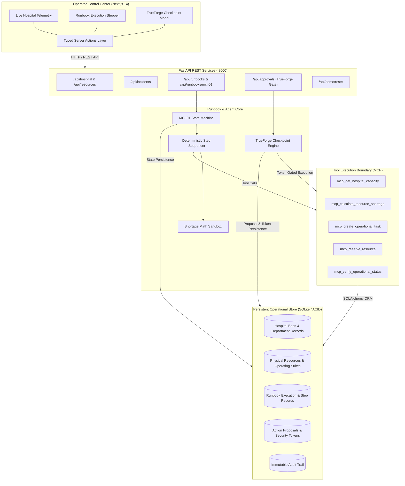
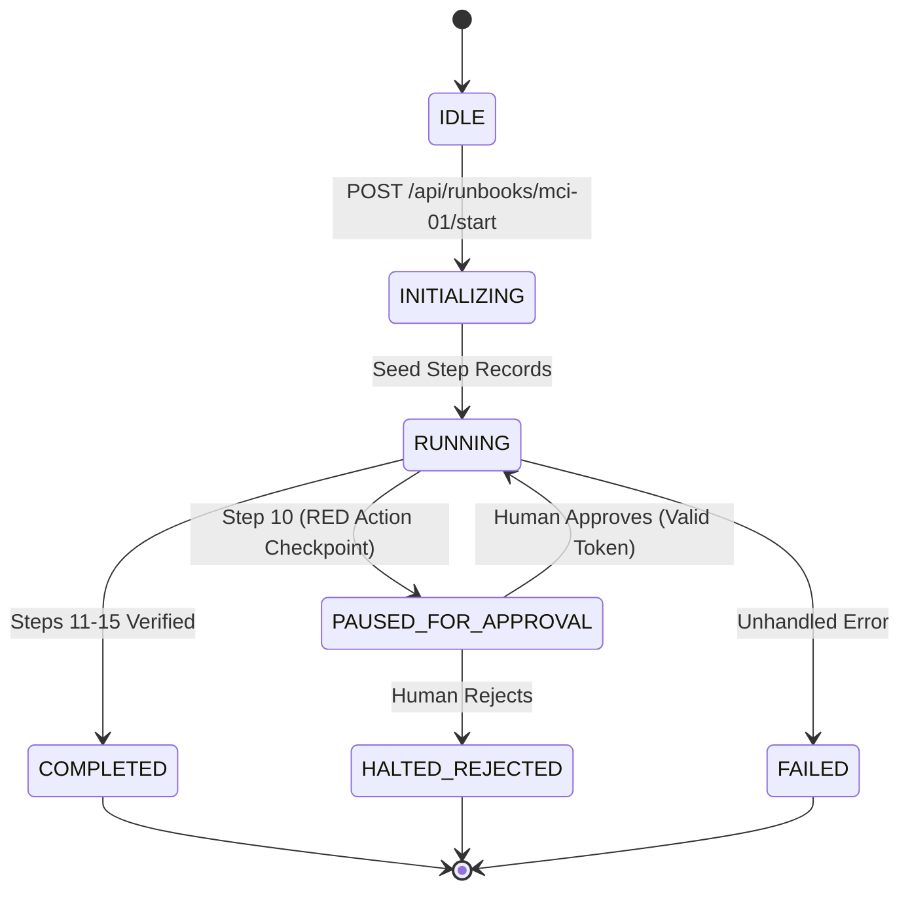

# AIMBULENCE — System Architecture Specification

> **Project:** AIMBULENCE — AI Emergency Hospital Operations Runbook Executor  
> **Repository:** [https://github.com/AkashMushigeri/Aimbulence](https://github.com/AkashMushigeri/Aimbulence)  
> **Status:** Production / Hackathon Complete  
> **Core Principle:** *"Autonomous in execution, but not autonomous in authority."*

---

## 1. Executive Summary

AIMBULENCE is an operational emergency runbook execution engine engineered for hospitals confronting Mass Casualty Incidents (MCIs). Unlike open-ended conversational chatbots, AIMBULENCE operates as a deterministic, tool-augmented agentic system that coordinates hospital resources, audits supply deficits, prepares triage infrastructure, and strictly pauses at consequential decisions for human sign-off via TrueForge.

---

## 2. High-Level System Architecture

---

## 3. Component Architecture & Responsibilities

### 3.1 Operator Dashboard (`frontend/`)
- **Framework:** Next.js 14 (App Router), TypeScript, Tailwind CSS, Lucide icons.
- **Strict Boundary Separation:** Frontend UI components never call `fetch()` directly; all network transport passes through typed Server Actions (`frontend/src/app/actions/operations.ts`) and tested domain mappers (`frontend/src/lib/mappers.ts`).
- **Telemetry & Visualization:**
  - Real-time bed occupancy gauges (ED, ICU, Floor).
  - Operating Room operational status monitor (OR-1, OR-2, OR-3).
  - Blood bank inventory levels with dynamic shortage alerts.
  - Interactive MCI-01 stepper tracking current step, status badges, and output metrics.
  - TrueForge Checkpoint Modal presenting blast-radius assessments, justification narratives, and single-use authorization triggers.

### 3.2 Backend REST Engine (`backend/app/`)
- **Framework:** FastAPI, Python 3.11+, Pydantic v2 schemas.
- **Endpoints:**
  - `/api/health`: Liveness and subsystem diagnostic checks.
  - `/api/hospital/status`: Comprehensive hospital capacity and department telemetry.
  - `/api/resources`: Physical assets, surgical suites, and inventory queries.
  - `/api/incidents`: Incident ingestion and registration.
  - `/api/runbooks`: Runbook execution lifecycle (`start`, `status`, `resume`, `cancel`).
  - `/api/approvals`: TrueForge human approval endpoints (`list`, `pending`, `respond`).
  - `/api/demo/reset`: Instant recovery to clean baseline state for repeatable demonstration.

### 3.3 MCI-01 Runbook Engine (`backend/app/runbooks/`)
- **Engine:** `RunbookEngine` (`engine.py`) managing `MCI01Runbook` (`mci_01.py`).
- **Execution Lifecycle:**
  1. `IDLE` ➔ `INITIALIZING` ➔ `RUNNING`
  2. Runs Steps 1 through 9 autonomously (verification, calculations, triage staging, blood bank reservation).
  3. Pauses before Step 10 (consequential RED action: Commandeer `OR-3`).
  4. Changes status to `PAUSED_FOR_APPROVAL` and waits indefinitely for human authorization.
  5. Upon operator approval with valid token, executes Step 10, transitions back to `RUNNING`, executes Steps 11–15, and transitions to `COMPLETED`.
  6. Upon operator rejection, transitions to `HALTED_REJECTED` and guarantees **zero state mutations**.

### 3.4 Model Context Protocol & Operational Tools (`backend/app/tools/` & `backend/app/mcp/`)
- **Protocol:** Standardized JSON-RPC Model Context Protocol tools.
- **Tools:**
  - `get_hospital_capacity`: Reads real-time beds, staff, and operating room allocations.
  - `calculate_resource_shortage`: Deterministic mathematical sandbox calculating exact supply deficits based on casualty count.
  - `create_operational_task`: Dispatches departmental tasks and logs operational directives.
  - `reserve_resource`: Allocates staging zones, equipment, and uncrossmatched blood reserves.
  - `verify_operational_status`: Confirms external database mutation has occurred before marking step successful.

### 3.5 TrueForge Safety & Checkpoint Subsystem (`backend/app/approval/`)
- **Authority Gate:** `TrueForgeCheckpointManager` intercepts any RED action.
- **Cryptographic Token Binding:**
  - Tokens are 32-byte cryptographically secure hexadecimal strings (`secrets.token_hex(32)`).
  - Explicitly bound to: `action_id`, `resource_id`, `required_role`, and creation timestamp.
  - Single-use consumption: once exchanged at `POST /api/approvals/{id}/respond`, the token is immediately marked `CONSUMED` and invalidated.
  - Replay attempts, cross-resource reuse, or unauthenticated executions immediately return `403 Forbidden` / `409 Conflict`.

### 3.6 Data Layer (`backend/app/models/` & `backend/app/services/database.py`)
- **Database:** SQLite with WAL mode, managed by SQLAlchemy ORM.
- **Relational Tables:**
  - `hospitals`: Hospital facilities and department metrics.
  - `resources`: Physical surgical suites, triage carts, blood supplies.
  - `incidents`: Incoming mass-casualty alerts.
  - `runbook_executions`: Runbook instances, parameters, and top-level states.
  - `runbook_steps`: Step-by-step audit records with inputs, outputs, and timestamps.
  - `action_proposals`: Pending and resolved TrueForge approval checkpoints with cryptographic token digests.
  - `audit_events`: Append-only, tamper-evident log of every state query, mutation, and operator action.

---

## 4. Runbook State Machine

---

## 5. Security & Boundary Enforcement

1. **Zero Preemptive Writes:** When a RED action is proposed, the database remains in its pre-proposal state. No optimistic updates or dirty reads occur.
2. **Replay & Injection Immunity:**
   - Attempting to use a token for Resource A on Resource B fails with `400 Bad Request`.
   - Attempting to reuse an already consumed token fails with `409 Conflict`.
   - Executing without an approval token fails with `403 Forbidden`.
3. **Process Crash Resilience:** If the server is killed while `PAUSED_FOR_APPROVAL`, the database retains the pending checkpoint. On restart, the checkpoint remains valid and the runbook can be safely resumed without duplicating earlier steps.
4. **Zero Secret Leakage:** No API keys, credentials, or session secrets are checked into source control; all sensitive configuration is loaded via environment variables (`.env`).
