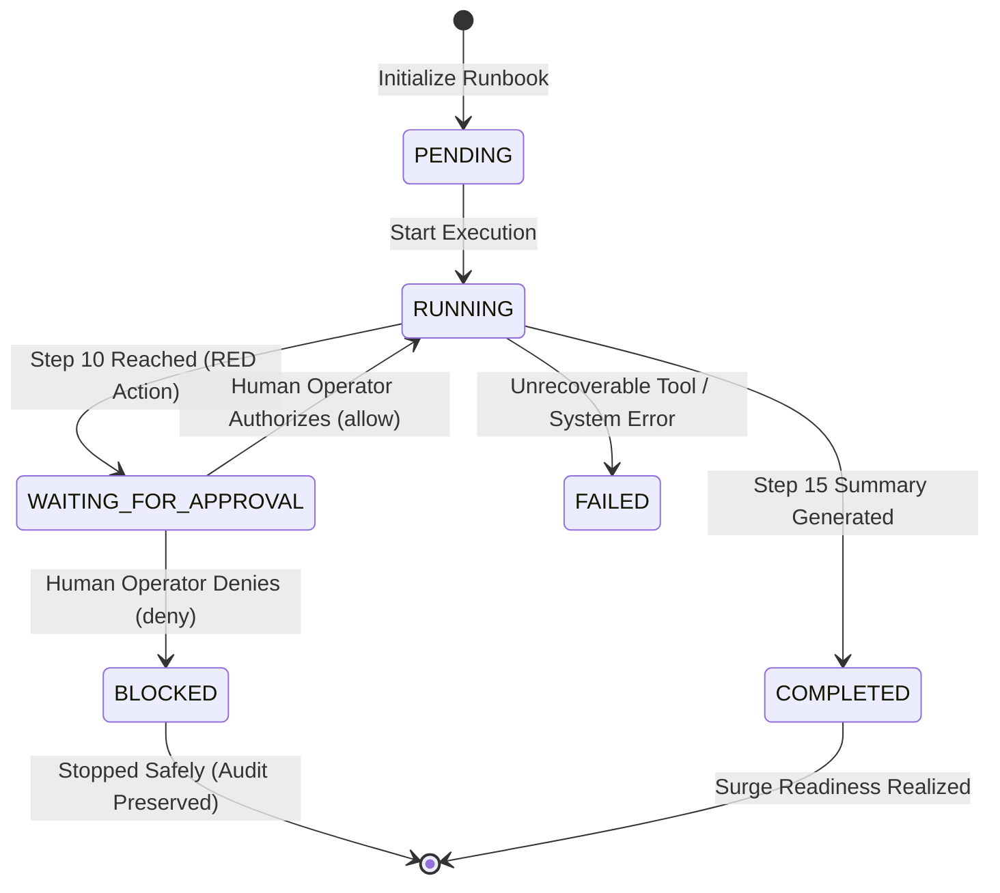

# AIMBULENCE — MCI-01 Operational Runbook Engine
### Mass Casualty Incident (MCI) Operational Surge Response

**Project:** AIMBULENCE — AI Emergency Hospital Operations Runbook Executor  
**Role:** Member 1 / Team Lead (Backend, Agent, Runbook Engine)  
**Branch:** `member-1`  
**Runbook Code:** `MCI-01`  
**Phase Status:** COMPLETE  

---

## 1. Runbook Purpose & Architecture

The **MCI-01 Runbook** coordinates emergency hospital operations during a mass-casualty disaster (e.g. multi-vehicle highway collision with 42 incoming acute trauma casualties). 

Rather than relying on an unpredictable, unconstrained autonomous LLM agent, AIMBULENCE implements a **deterministic, observable, resumable, and safe runbook execution engine**. The engine executes operational steps via persistent tools, rigorously protects patient safety by halting at TrueForge human approval checkpoints for high-consequence (**RED**) actions, and commits immutable audit events for every transition.

```
                    MCI INCIDENT (e.g. INC-MCI-42)
                                 │
                                 ▼
                     AIMBULENCE RUNBOOK ENGINE
                                 │
                                 ▼
                          MCI-01 RUNBOOK
                                 │
                 ┌───────────────┴───────────────┐
                 ▼                               ▼
       GREEN / YELLOW STEPS                  RED ACTION
                 │                               │
       Operational Tool Layer             TrueForge Checkpoint
                 │                               │
              Execute                            ▼
                 │                         HUMAN APPROVAL
              Verify                       (allow / deny)
                 │                               │
                 │                    ┌──────────┴──────────┐
                 │                    ▼                     ▼
                 │                 APPROVED              REJECTED
                 │                    │                     │
                 │             Execute Mutation      Zero Mutation
                 │             with Bound Token             │
                 │                    │                     ▼
                 │                 Verify                BLOCKED /
                 │                    │                 ESCALATED
                 │                    ▼
                 └──────────► Continue Runbook
                              (Steps 12 - 15)
                                      │
                                      ▼
                                  COMPLETED
```

---

## 2. Runbook State Machine



### State Definitions

| State | Description | Next Permitted States |
|:---|:---|:---|
| `PENDING` | Runbook execution record created; awaiting engine invocation | `RUNNING` |
| `RUNNING` | Actively executing sequential operational steps | `WAITING_FOR_APPROVAL`, `COMPLETED`, `FAILED` |
| `WAITING_FOR_APPROVAL` | Halted at TrueForge checkpoint; awaiting human operator sign-off | `RUNNING` (if approved), `BLOCKED` (if denied) |
| `BLOCKED` | Operator denied preemption; runbook safely halted without side effects | Terminal |
| `COMPLETED` | All 15 operational steps successfully executed and verified | Terminal |
| `FAILED` | Fatal exception occurred during execution | Terminal |

---

## 3. The 15 Operational Steps of MCI-01

| Step # | Step ID | Name | Safety Tier | Underlying Tool / Method | Verification Requirement |
|:---:|:---|:---|:---:|:---|:---|
| **1** | `MCI-01-01` | Detect and register MCI incident | `GREEN` | `detect_incident` / `IncidentRecord` | Incident record validated in SQLite |
| **2** | `MCI-01-02` | Verify incident operational details | `GREEN` | `verify_incident` | Casualty count >= 1, severity in [HIGH, CRITICAL] |
| **3** | `MCI-01-03` | Read current hospital capacity | `GREEN` | `get_hospital_capacity` | Live counts of ED beds, ICU, ORs, staff, blood |
| **4** | `MCI-01-04` | Calculate resource shortages | `GREEN` | `calculate_resource_shortage` | Acute deficit matrix (30 ED beds, 4 ICU, 3 ORs) |
| **5** | `MCI-01-05` | Create primary MCI coordination task | `GREEN` | `create_operational_task` | Task persisted in `operational_tasks` as `PENDING` |
| **6** | `MCI-01-06` | Inspect available resources | `GREEN` | `get_resource_status` | Catalog of specific assets ready for allocation |
| **7** | `MCI-01-07` | Stage safe available resources | `YELLOW` | `reserve_resource` (ED-01, MEDIC-01, OR-2) | Resources verified reserved in SQLite |
| **8** | `MCI-01-08` | Recalculate remaining shortages | `GREEN` | `calculate_resource_shortage` | Residual OR deficit confirmed post-OR-2 staging |
| **9** | `MCI-01-09` | Identify whether consequential RED action is required | `GREEN` | `identify_red_action` | Identifies `OR-3` (`Elective Knee Debridement`) as candidate |
| **10** | `MCI-01-10` | Propose RED action & pause at TrueForge checkpoint | `RED` | `approval_manager.pause_for_approval` | Checkpoint `tool.approval_required` created in SQLite |
| **11** | `MCI-01-11` | Execute authorized consequential action or process rejection | `RED` | `approval_manager.execute_and_verify_approved_red_action` | Single-use token consumed; mutation applied OR blocked |
| **12** | `MCI-01-12` | Verify resulting operational state | `GREEN` | `verify_operational_status` | Direct SQLite check confirms `OR-3` is `RESERVED_FOR_TRAUMA` |
| **13** | `MCI-01-13` | Recalculate hospital capacity post-preemption | `GREEN` | `calculate_resource_shortage` | Shortage recalculation reflects unlocked surgical capacity |
| **14** | `MCI-01-14` | Create follow-up tasks & notifications | `GREEN` | `create_operational_task` | Orthopedic team notified & Blood Bank alerted |
| **15** | `MCI-01-15` | Generate final runbook execution summary | `GREEN` | `generate_execution_summary` | Comprehensive JSON report; state marked `COMPLETED` |

---

## 4. TrueForge Human-in-the-Loop Checkpoint Integration

AIMBULENCE reuses the exact Phase 4 TrueForge checkpoint infrastructure. When Step 10 executes:
1. `RedActionProposal` is constructed for `OR-3`:
   - Risk Level: `RED`
   - Target Resource: `OR-3`
   - Current State: `IN_USE` (`Elective Arthroscopic Knee Debridement`)
   - Proposed State: `RESERVED_FOR_TRAUMA` (`is_emergency_cleared = True`, `scheduled_procedure = "POSTPONED: ..."`)
   - Clinical Benefit: Converts elective room into active trauma surgical suite.
   - Clinical Trade-off: Elective surgery postponed and rescheduled.
2. `approval_manager.pause_for_approval()` emits TrueForge event `tool.approval_required` and creates checkpoint `CHK-...`.
3. The RunbookEngine halts execution immediately, saves state as `WAITING_FOR_APPROVAL`, stores `checkpoint_id`, and commits to SQLite.

### Resolution Scenarios

- **Path A: Rejection (`deny` / `REJECT`):**
  - Human operator denies action on clinical safety grounds.
  - Checkpoint transitions to `REJECTED`.
  - When resumed, Step 11 detects rejection, leaves SQLite completely untouched, marks step as `BLOCKED`, and sets runbook state to `BLOCKED`.
- **Path B: Authorization (`allow` / `APPROVE`):**
  - Human operator authorizes preemption.
  - Single-use cryptographically bound token `AUTH-APPROVED-...` is issued.
  - When resumed, Step 11 consumes the token, mutates `OR-3` to `RESERVED_FOR_TRAUMA`, verifies state on disk, and seamlessly advances through Steps 12–15 to `COMPLETED`.

---

## 5. Persistence & Resumability

Runbook state is never stored in volatile Python memory alone. Two dedicated tables in SQLite manage lifecycle persistence:

1. **`runbook_executions`:**
   - Tracks `id`, `runbook_id`, `incident_id`, `state`, `current_step_id`, `checkpoint_id`, `parameters_json`, `context_json`, `started_at`, `updated_at`, `completed_at`.
2. **`runbook_step_executions`:**
   - Tracks each step's execution: `execution_id`, `step_id`, `step_number`, `name`, `safety_category`, `status`, `input_json`, `output_json`, `verification_json`, timestamps.

### Process Restart Recovery
If the server crashes or restarts while in `WAITING_FOR_APPROVAL`:
- Reconnecting to SQLite restores the exact execution state and checkpoint ID.
- Completed steps (1 through 9) are flagged as `COMPLETED` and are **never re-executed** (Idempotency guarantee).
- Calling `POST /api/runbooks/{execution_id}/resume` after operator approval continues directly from Step 11.

---

## 6. REST API Contract

### 1. Start Runbook
- **Method:** `POST /api/runbooks/mci/start`
- **Request:**
```json
{
  "incident_id": "INC-MCI-42",
  "incoming_casualties": 42,
  "acute_ratio": 0.5
}
```
- **Response (`201 Created`):**
```json
{
  "runbook_execution_id": "RBX-D736A471",
  "runbook_id": "MCI-01",
  "incident_id": "INC-MCI-42",
  "state": "WAITING_FOR_APPROVAL",
  "current_step": "MCI-01-10",
  "checkpoint_id": "CHK-8B1E94C2",
  "message": "Runbook initiated. Current state: WAITING_FOR_APPROVAL at step MCI-01-10."
}
```

### 2. Query Runbook Status
- **Method:** `GET /api/runbooks/{execution_id}`
- **Response (`200 OK`):** Full `RunbookExecutionState` object containing completed steps, step outputs, and checkpoint status.

### 3. Resume Runbook
- **Method:** `POST /api/runbooks/{execution_id}/resume`
- **Request Body (Optional):** `{"reason": "Operator authorized in dashboard"}`
- **Preconditions:** Checkpoint must have been resolved via `/api/approval/decide`. If still pending, returns `409 Conflict`.
- **Response (`200 OK`):** Updated execution state (`COMPLETED` or `BLOCKED`).

---

## 7. Automated Test Verification

All 42 tests across all 5 phases pass cleanly:

```
backend/tests/test_contracts.py ......... 7 passed (Phase 1)
backend/tests/test_tools.py ............. 11 passed (Phase 2)
backend/tests/test_phase3_mcp.py ........ 7 passed (Phase 3)
backend/tests/test_phase4_approval.py ... 9 passed (Phase 4)
backend/tests/test_phase5_runbook.py .... 8 passed (Phase 5)
======================== 42 passed, 1 warning in 5.30s ========================
```
