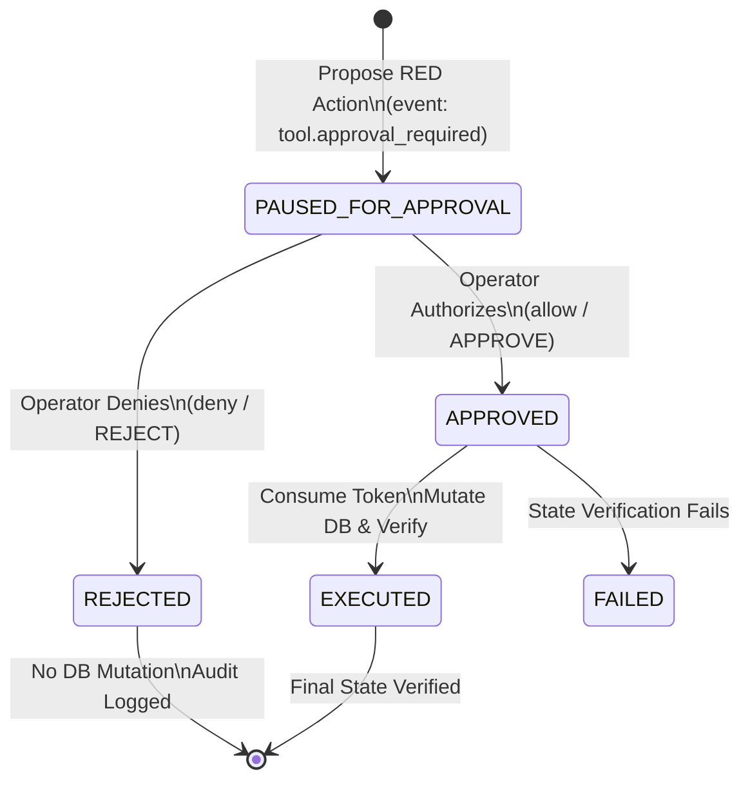

# AIMBULENCE — Phase 4: TrueForge Human-in-the-Loop Approval Checkpoint

**Project:** AIMBULENCE — AI Emergency Hospital Operations Runbook Executor  
**Role:** Member 1 / Team Lead (Backend, Agent, Runbook Engine)  
**Branch:** `member-1`  
**Phase Status:** COMPLETE  

---

## 1. Executive Summary

Phase 4 implements the **TrueForge Human-in-the-Loop (HITL) Approval Checkpoint** for high-consequence (**RED**) hospital operations. In an emergency mass-casualty incident (MCI), automated tools can safely execute routine inventory queries (**GREEN**) and staged reservations (**YELLOW**), but any action that carries direct clinical or ethical trade-offs—such as preempting an occupied operating room and postponing a human surgical procedure—must halt execution at a TrueForge approval boundary until explicitly authorized by a qualified human operator.

### The 8-Step Consequential Operational Cycle

```
DETECT ──► VERIFY ──► PROPOSE ──► TRUEFORGE PAUSES ──► HUMAN APPROVAL ──► EXECUTE ──► VERIFY ──► AUDIT
```

1. **DETECT:** Incident demand analysis detects resource deficit (e.g. 42 incoming casualties demand 3 operating rooms, creating a severe shortage).
2. **VERIFY:** Tool queries current resource status on disk (identifies OR-3 as an elective arthroscopic surgery candidate for preemption).
3. **PROPOSE:** Agent constructs a structured `RedActionProposal` detailing risk level, trade-offs, clinical consequences, and expected benefits.
4. **TRUEFORGE PAUSES:** Execution halts at the TrueForge checkpoint (`tool.approval_required`). No database mutations occur.
5. **HUMAN APPROVAL:** Human operator reviews proposal in clinical UI/API and submits an authorized decision (`allow` or `deny`).
6. **EXECUTE:** Consequential mutation executes against persistent SQLite database **only** upon presentation of a valid single-use cryptographic token.
7. **VERIFY:** Post-execution tool queries disk state directly to confirm target state (`RESERVED_FOR_TRAUMA`) materialized on disk.
8. **AUDIT:** Immutable transactional audit events are committed to SQLite documenting every transition with actor attribution.

---

## 2. TrueForge Checkpoint State Machine



### TrueForge Protocol Alignment

| TrueForge Event / Schema | AIMBULENCE Phase 4 Mapping | Purpose |
|:---|:---|:---|
| `tool.approval_required` | `CheckpointState.PAUSED_FOR_APPROVAL` | Emitted when agent proposes RED action; pauses agent loop |
| `UserToolApprovalMessageSchema` (`allow`) | `ApprovalDecisionType.ALLOW` / `APPROVE` | Human operator grants authorization |
| `UserToolApprovalMessageSchema` (`deny`) | `ApprovalDecisionType.DENY` / `REJECT` | Human operator denies action with reasoning |
| `token_consumed` Gate | Single-use cryptographically bound token | Prevents replay attacks and cross-resource execution |

---

## 3. Cryptographic Single-Use Authorization Token Architecture

A common vulnerability in automated agent systems is the reliance on generic boolean flags (e.g. `approved: true`). AIMBULENCE eliminates this vulnerability through **cryptographically bound single-use authorization tokens**:

### Token Format
```
AUTH-APPROVED-{checkpoint_id}-{affected_resource}-{entropy_uuid}
```
*Example:* `AUTH-APPROVED-CHK-4E728E62-OR-3-19E10BC6`

### Security Guarantees

1. **Resource Binding:** A token issued for `OR-3` is rejected if presented to preempt `OR-4` or any other resource (`UnauthorizedRedActionError: Token issued for resource 'OR-3', not 'OR-4'`).
2. **Action Binding:** A token issued for `ACT-PREEMPT-OR3` cannot be reused for any other operational action.
3. **Replay Protection:** The token is flagged as `token_consumed = True` on initial execution. A second submission immediately raises `UnauthorizedRedActionError: Authorization token has already been consumed. Replay attack prevented.`
4. **Rejection Hard-Stop:** If a checkpoint is in `REJECTED` state, token issuance is skipped and execution is strictly blocked.
5. **No State Mutation on Denial:** In the rejection path, the SQLite database remains completely unmodified.

---

## 4. Operational Scenario: Preempting OR-3 for 42 Casualties

### Initial State
- **Hospital:** Metro Central Trauma Hospital
- **Incoming Demand:** 42 casualties from highway multi-vehicle collision (`INC-MCI-42`)
- **OR Inventory:**
  - `OR-1`: `IN_USE` (Active emergency trauma laparotomy)
  - `OR-2`: `OPEN` (Available immediately)
  - `OR-3`: `IN_USE` (`Elective Arthroscopic Knee Debridement`)
  - `OR-4`: `IN_USE` (`Elective Inguinal Hernia Repair`)
  - `OR-5`: `IN_USE` (`Elective Cholecystectomy`)
- **Computed Deficit:** 3 operating rooms needed; only 1 open. Deficit = 2 ORs.

### Path A: Human Operator Denies Action (Rejection Path)
1. Shortage detected (3-OR deficit).
2. OR-3 verified as elective procedure.
3. `ACT-PREEMPT-OR3` proposed.
4. Execution halts at checkpoint `CHK-...` with status `tool.approval_required`.
5. Human operator (Dr. Marcus Vance, Chief Medical Officer) reviews and denies:
   - Decision: `deny`
   - Clinical Rationale: *"Patient already inducted in OR-3. Preemption denied on clinical safety grounds."*
6. Checkpoint state updates to `REJECTED`. Authorization token remains `null`.
7. Execution blocked: OR-3 on SQLite remains `status = "IN_USE"`, scheduled procedure remains `"Elective Arthroscopic Knee Debridement"`.
8. Audit event `APPROVAL_REJECTED` recorded in SQLite.

### Path B: Human Operator Authorizes Action (Approval Path)
1. Shortage detected (3-OR deficit).
2. OR-3 verified as elective procedure.
3. `ACT-PREEMPT-OR3` proposed.
4. Execution halts at checkpoint `CHK-...` with status `tool.approval_required`.
5. Human operator (Dr. Eleanor Vance, Trauma Medical Director) reviews and authorizes:
   - Decision: `allow`
   - Clinical Rationale: *"Elective knee surgery held in pre-op; OR-3 cleared for trauma surge."*
6. Checkpoint state updates to `APPROVED`. Bound token `AUTH-APPROVED-...` issued.
7. Execution proceeds:
   - OR-3 status mutated to `RESERVED_FOR_TRAUMA`.
   - `is_emergency_cleared = True`.
   - `scheduled_procedure = "POSTPONED: Elective Arthroscopic Knee Debridement"`.
   - Token consumed (`token_consumed = True`).
8. Verification tool queries SQLite disk directly and verifies `RESERVED_FOR_TRAUMA`.
9. Audit trail commits `APPROVAL_GRANTED` and `CONSEQUENTIAL_ACTION_EXECUTED`.

---

## 5. REST API Contract for Human Approval Checkpoints

The FastAPI backend exposes the complete checkpoint lifecycle under `/api/approval`:

### 1. List Checkpoints
- **Method:** `GET /api/approval/checkpoints`
- **Query Parameter:** `state` (Optional: filter by `tool.approval_required`, `APPROVED`, `REJECTED`, `EXECUTED`)
- **Response:** `200 OK` — Array of `TrueForgeApprovalCheckpoint` objects.

### 2. Get Checkpoint Detail
- **Method:** `GET /api/approval/checkpoints/{checkpoint_id}`
- **Response:** `200 OK` — `TrueForgeApprovalCheckpoint` object.
- **Errors:** `404 Not Found` if checkpoint does not exist.

### 3. Propose RED Consequential Action
- **Method:** `POST /api/approval/propose`
- **Status:** `201 Created`
- **Request Body:**
```json
{
  "action_id": "ACT-PREEMPT-OR3",
  "action_type": "PREEMPT_OPERATING_ROOM",
  "risk_level": "RED",
  "safety_category": "RED",
  "affected_resource": "OR-3",
  "current_state": {
    "status": "IN_USE",
    "scheduled_procedure": "Elective Arthroscopic Knee Debridement"
  },
  "proposed_state": {
    "status": "RESERVED_FOR_TRAUMA",
    "is_emergency_cleared": true,
    "scheduled_procedure": "POSTPONED: Elective Arthroscopic Knee Debridement"
  },
  "reason": "MCI casualty surge requires trauma surgical capacity.",
  "expected_benefit": "Unlocks trauma surgical suite OR-3 for life-saving surgery.",
  "potential_consequence": "Elective orthopedic procedure postponed.",
  "incident_id": "INC-MCI-42",
  "requires_human_approval": true
}
```
- **Response:** Checkpoint in state `tool.approval_required`.

### 4. Submit Decision (HITL Interface)
- **Method:** `POST /api/approval/decide`
- **Status:** `200 OK`
- **Request Body:**
```json
{
  "checkpoint_id": "CHK-4E728E62",
  "decision": "allow",
  "decision_by": "Dr. Eleanor Vance, Trauma Medical Director",
  "reason": "Elective knee surgery held in pre-op; OR-3 cleared for trauma surge.",
  "execute_if_approved": true
}
```
- **Response:**
```json
{
  "status": "DECIDED",
  "checkpoint": {
    "checkpoint_id": "CHK-4E728E62",
    "state": "EXECUTED",
    "authorization_token": "AUTH-APPROVED-CHK-4E728E62-OR-3-19E10BC6",
    "token_consumed": true
  },
  "execution": {
    "status": "SUCCESS",
    "resource": "OR-3",
    "new_state": {
      "status": "RESERVED_FOR_TRAUMA",
      "is_emergency_cleared": true
    },
    "verification": {
      "verified": true,
      "status": "VERIFIED",
      "actual_value": "RESERVED_FOR_TRAUMA"
    }
  }
}
```

---

## 6. Frontend Integration Contract for Member 2

Member 2 (Frontend Lead) can build the Human-in-the-Loop Operator Panel using these exact endpoints:

1. **Pending Checkpoint Alert:**
   - Poll `GET /api/approval/checkpoints?state=tool.approval_required` (or SSE stream).
   - When checkpoints are present, display prominent **RED ACTION APPROVAL REQUIRED** modal.
2. **Modal Content:**
   - Action Name: `proposal.action_type` (e.g. `PREEMPT_OPERATING_ROOM`)
   - Resource: `proposal.affected_resource` (`OR-3`)
   - Current State: `IN_USE` (`Elective Arthroscopic Knee Debridement`)
   - Expected Benefit: `proposal.expected_benefit`
   - Clinical Trade-off: `proposal.potential_consequence`
   - Justification: `proposal.reason`
3. **Operator Controls:**
   - Name / Role Input (required)
   - Clinical Reasoning Textarea (optional for allow, recommended for deny)
   - **Authorize Button (Green / Danger Outline):** Sends `POST /api/approval/decide` with `decision: "allow"`
   - **Reject Button (Red):** Sends `POST /api/approval/decide` with `decision: "deny"`

---

## 7. Verification & Automated Test Results

The complete test suite verifies the entire system across all 4 phases:

```
backend/tests/test_contracts.py ......... 7 passed (Phase 1)
backend/tests/test_tools.py ............. 11 passed (Phase 2)
backend/tests/test_phase3_mcp.py ........ 7 passed (Phase 3)
backend/tests/test_phase4_approval.py ... 9 passed (Phase 4)
======================== 34 passed, 1 warning in 2.34s ========================
```

### Phase 4 Test Breakdown (`test_phase4_approval.py`)

| Test Name | Verified Safety Guarantee | Result |
|:---|:---|:---:|
| `test_propose_red_action_creates_paused_checkpoint` | Proposing RED action halts in `tool.approval_required` state | PASSED |
| `test_execution_without_token_raises_unauthorized` | Execution without valid token raises `UnauthorizedRedActionError` | PASSED |
| `test_human_rejection_prevents_mutation_and_records_audit` | Denial marks `REJECTED`, leaves SQLite untouched, logs audit | PASSED |
| `test_human_approval_issues_bound_token` | Approval transitions to `APPROVED`, issues bound token | PASSED |
| `test_execution_mutates_sqlite_and_verifies_state` | Authorized execution mutates OR-3 and verifies `RESERVED_FOR_TRAUMA` | PASSED |
| `test_token_binding_prevents_resource_cross_application` | Token for OR-3 cannot be used on OR-4 | PASSED |
| `test_token_replay_attack_prevented` | Single-use token cannot be consumed a second time | PASSED |
| `test_complete_human_in_the_loop_cycle_runner` | Complete 8-step cycle runner executes end-to-end for both paths | PASSED |
| `test_approval_api_endpoints` | REST endpoints for propose, list, get, and decide function properly | PASSED |
